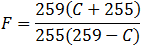
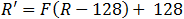

# Laboratório de Programação II - 2018/1

## Tarefa 1 - Vetores/Matrizes

### [Descrição](DESCRICAO.MD)

O trabalho consiste na implementação de um editor para imagens no formato PPM, variante P3. Cada imagem contém um cabeçalho com dimensões e quantidade de cores por canal. Após isto, cada pixel é definido por um conjunto de três inteiros, cada um representando um valor na escala RGB.

Há um total de 10 filtros que podem ser aplicados na imagem:

- [Recorte](#recorte--u-altura-largura-deslocamento_y-deslocamento_x)
- Edição
  - [Brilho](#brilho--b-porcentagem)
  - [Contraste](#contraste--t-porcentagem)
  - [Canal de cor](#canal-de-cor--c-cores)
  - [Negativo](#negativo--n)
- Posição
  - [Espelhar](#espelhar--e)
  - [Virar](#virar--v)
  - [Girar](#girar--g-graus)
  - [Distorcer](#distorcer--d-ap%C3%93tema)
- [Matriz de Convolução (3x3)](#matriz-de-convolução--k-valores-xdivisor)

## Compilação

O programa segue o padrão C ANSI, portanto pode ser compilado pelo comando ``gcc editor_ppm.c -ansi``

Codificação ``Western Windows 1252``

## Uso e implementação

O primeiro argumento deve ser o nome do arquivo de origem. O parâmetro ``-o`` permite definir um arquivo de saída. Se o parâmetro não for utilizado, o arquivo de origem será sobre-escrito.

Após armazenar o nome do arquivo, cada argumento é lido. Filtros que requerem parâmetros adicionais também são armazenados e recebem testes básicos (se a área para cortar a imagem á maior que zero, por exemplo). O programa encerra caso identifique parâmetros inválidos, exibindo uma ajuda resumida.

Após a leitura dos parâmetros, é verificado se pelo menos um filtro foi selecionado e é feita a leitura da imagem. Caso tenha definido, o nome do arquivo de saída é impresso. Caso contrário, uma mensagem informando que a imagem será sobre-escrita é exibida e o nome do arquivo é copiado para a variável ``arq_saida``.

Antes de aplicar os filtros, outras validações (que precisavam aguardar a leitura do arquivo) são feitas, para evitar que o processo seja interrompido após a execução de vários filtros.

Cada filtro é aplicado na ordem exibida na seção acima (independente da ordem que os parâmetros foram informados).

Por fim, a imagem é salva e o programa é encerrado, retornando o código ``0``.

Por exemplo, para ler o arquivo ``imagem1.ppm``, aplicar o filtro espelhar e salvar em ``imagem2.ppm``, usaria o seguinte comando no Windows:

``editor_ppm imagem1.ppm -e -o imagem2.ppm`` 

### Leitura da imagem

A imagem é definida por um _struct_ que contém:

- ponteiro para o arquivo
- nome do arquivo de entrada
- altura em pixels
- largura em pixels
- profundidade de cor
- ponteiro para a matriz de pixels

Após a leitura do cabeçalho, a matriz de pixels é alocada dinamicamente (a partir das dimensões lidas). Cada pixel é um _struct_ com os valores na escala RGB.

Se a leitura for concluída sem erros, uma mensagem de confirmação é exibida.

### Salvamento da imagem

A função para salvar o arquivo divide-se em duas partes

1. o arquivo informado na variável ``arq_saida`` é aberto e o cabeçalho é impresso. Após, cada pixel é exportado para uma linha do arquivo e este é fechado.
2. todos os valores alocados são liberados, como matriz de pixels, string para o nome, etc...

### Filtros

#### Recorte (``-u ALTURA LARGURA DESLOCAMENTO_Y DESLOCAMENTO_X``)

O filtro de recorte possui dois parâmetros obrigatórios (as novas dimensões da imagem) e dois opcionais (um deslocamento a partir de onde será copiada a imagem). As novas dimensões devem ser maiores que zero e não podem exceder o tamanho da imagem original.

Quando a função é chamada, uma nova matriz de pixels é alocada com o tamanho informado. Então a imagem é copiada a partir do deslocamento (caso não tenha sido informado, ambos os valores serão ``0``).

A matriz original é apagada e o struct ``imagem`` é atualizado com os novos valores.

#### Brilho (``-b PORCENTAGEM``)

O fator de brilho é calculado dividindo o valor informado pelo usuário por 100 e multiplicando pela profundidade de cores da imagem.

Este valor, que pode ser positivo ou negativo, é somado à cada pixel da imagem. Por fim, estes pixels são "validados", ou seja, verifica-se se nenhum pixel ultrapassou a profundidade de cor ou recebeu um valor menor do que zero.

#### Contraste (``-t PORCENTAGEM``)

O cálculo do contraste é dividido em duas partes: primeiro aplica-se a [fórmula](http://www.dfstudios.co.uk/articles/programming/image-programming-algorithms/image-processing-algorithms-part-5-contrast-adjustment) abaixo, onde C representa o valor informado pelo usuário:



Após, este valor é aplicado nesta segunda fórmula, onde R representa cada canal de cor da imagem



Por fim, as cores são validadas (igual foi feito com a função para alterar o brilho).

#### Canal de Cor (``-c CORES``)

Para aplicar este filtro, o usuário deve informar pelo menos uma das 3 faixas de cor RGB. Para isto, após o parâmetro ``-c``, deve-se informar a cor (``r``, ``g``, ou ``b``) seguida do valor. A ordem que as cores são lidas não importa, já que os valores são obtidos a partir de um _switch_ na função principal.

Por exemplo, para aumentar a cor azul em ``25`` e diminuir a cor vermelha em ``40``, informaria o seguinte parâmetro:

```imagem.ppm -c b25 r-40```

São feitos testes para garantir que a cor seja válida (semelhante ao exemplo acima) e que pelo menos uma cor seja informada.

A função apenas soma os valores informados em cada cor e valida.

#### Negativo (``-n``)

Inverte as cores da imagem. 

A função apenas subtrai o valor de cada pixel da profundidade de cor da imagem.

#### Espelhar (``-e``)

Inverte a imagem horizontalmente.

A função aloca uma nova matriz de pixels e copia cada coluna em ordem inversa, apagando a matriz original ao concluir.

#### Virar (``-v``)

Inverte a imagem verticalmente.

Semelhantemente ao filtro Espelhar, aloca uma nova matriz de pixels e copia cada linha em ordem inversa, apagando a matriz original ao concluir.

#### Girar (``-g GRAUS``)

Rotaciona a imagem 90, 180 ou 270 graus no sentido horário.

O usuário deve informar um dos três valores possíveis. Ao ler os parâmetros, é verificado se o usuário informou este dado.

Dentro da função há dois fluxos possíveis, de acordo com o valor da rotação:

- 180 graus
  1. Aloca uma matriz de mesmo formato e dimensões da imagem original
  2. Executa um loop para copiar os pixels na ordem correta
  
- 90 ou 270 graus
  1. Aloca uma matriz com as dimensões opostas da imagem original
  2. Testa qual o valor entre os dois possíveis e executa um loop onde faz a cópia dos valores na ordem correta
  3. Inverte as definições de altura e largura no _struct_
  
Após executar o fluxo correto, a matriz original é destruída (desalocada) e o ponteiro no _struct_ é atualizado com a nova matriz.

#### Distorcer (``-d APÓTEMA``)

Apótema é a distância entre o centro de um quadrado e um de seus lados. Este filtro permite "embaralhar" os pixels da imagem. Este processo é delimitados por uma área, cuja apótema deve ser informada pelo usuário.
 
 Em outras palavras, a apótema define a distância em pixels que um determinado ponto pode ser deslocado.
 
 Embora o valor máximo da apótema seja o da própria imagem (ou seja, o menor lado da imagem dividido por 2), mesmo valores pequenos como 20 ou 30 já são suficientes para tornar a imagem irreconhecível. O valor deve ser diferente de zero.
 
 A função percorre cada pixel da imagem, sorteia um outro pixel aleatório dentro da área de distorção e troca estes de posição, verificando se não ultrapassou as bordas da imagem.

#### Matriz de Convolução (``-k VALORES xDIVISOR``)

A Matriz de Convolução permite aplicar diversos filtros na imagem. [Este link](https://docs.gimp.org/2.8/pt_BR/plug-in-convmatrix.html) contém alguns exemplos de núcleos que podem ser utilizados para o filtro.

O filtro aceita núcleos de 3x3. Cada valor deve ser informado individualmente, em ordem, como no exemplo abaixo:

    00  01  02
    10  11  12
    20  21  22   

``-k 00 01 02 10 11 12 20 21 22``

Também é possível informar um divisor. Este deve ser o último parâmetro (após informar todo o núcleo) e deve ser precedido pela letra ``x``.

Para definir um divisor de 5 ao exemplo acima, o comando ficaria
 ``-k 00 01 02 10 11 12 20 21 22 x5``
 
 A função aloca uma nova matriz para armazenar os pixels que foram alterados (isto evita que um pixel já modificado altere o resultado final).
 
 Cada pixel é multiplicado pelo kernel, seguindo a fórmula [deste artigo da Wikipédia](https://en.wikipedia.org/wiki/Kernel_(image_processing)#Convolution).
 
 Após atualizar o ponteiro no _struct_ e apagar a matriz antiga, um último loop é feito para validar os pixels (testar se todos os valores estão entre 0 e a profundidade de cores)
 
 ## Códigos de Erro
 
 Em caso de erro na execução do programa, os seguintes códigos de erro podem ser retornados: 
 
1. Parâmetros incorretos
2. Erro ao abrir arquivo
3. Formato de arquivo inválido
4. Dimensões inválidas
5. Falha ao alocar Imagem (struct)
6. Falha ao alocar string
7. Falha ao alocar matriz (linhas)
8. Falha ao alocar matriz (colunas)
9. Erro ao salvar o arquivo